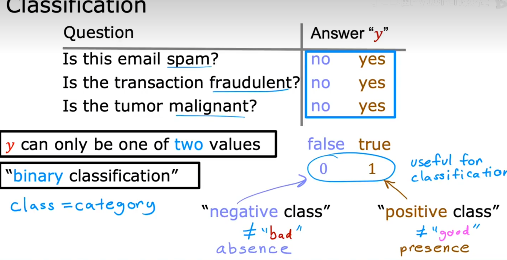

# 动机(motivation)

在机器学习和数据分析中，**动机（Motivation）** 指的是我们为什么要研究某个问题、提出某种方法或改进某个模型。明确动机有助于理解问题的本质和研究的意义。

常见的动机包括：
- 现有方法存在局限性或不足，需要改进
- 希望提升模型的准确率或泛化能力
- 解决实际应用中的某类问题
- 降低计算复杂度或提高效率
- 让模型更易于解释或部署

**总结：**  
明确动机可以帮助我们更好地选择合适的方法和技术路线，也是科学研究和工程实践的重要出发点。

