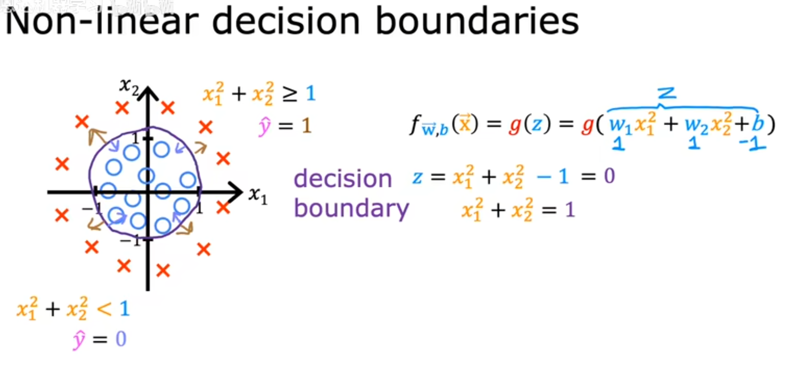
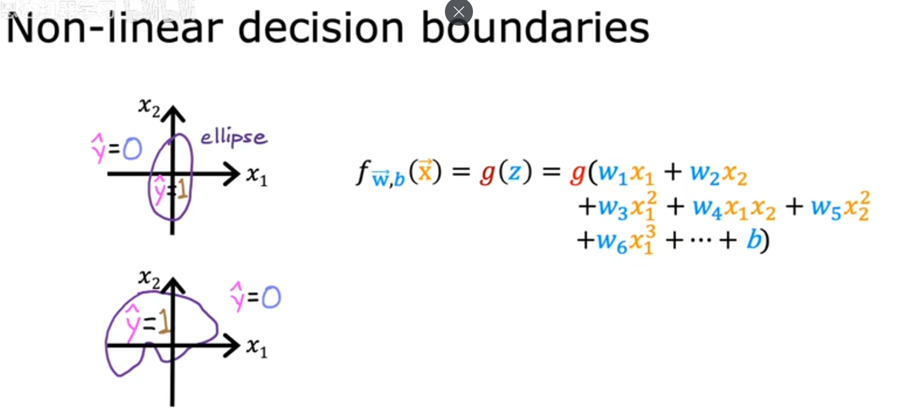
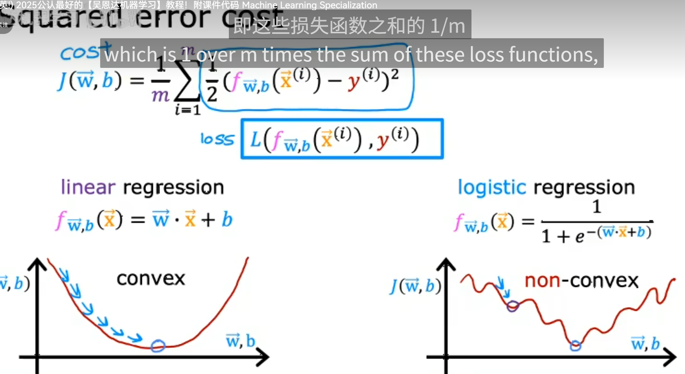
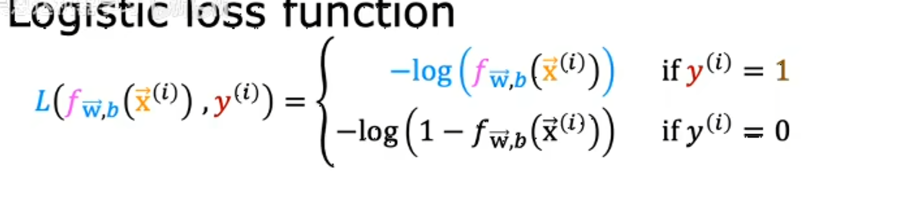

# 逻辑回归(Logistic Regression)

逻辑回归是一种用于解决二分类问题的统计模型。它通过将线性回归的结果输入到Sigmoid函数中，将输出值限制在0到1之间，从而可以解释为概率。

## 1. 基本概念

### 1.1 线性回归与逻辑回归的区别
- 线性回归：用于预测连续值。
- 逻辑回归：用于预测离散值（通常是二分类问题）。

### 1.2 Sigmoid函数
Sigmoid函数的公式为：
$$\sigma(z) = \frac{1}{1 + e^{-z}}$$
它将任何实数值映射到0到1之间。

## 2. 模型公式

逻辑回归的假设函数为：

$$ 
h_\theta(x) = \sigma(\theta^T x) 
$$
其中，$\theta$ 是参数向量， $x$ 是特征向量。

## 3. 成本函数

逻辑回归的成本函数为：
$$
J(\theta) = -\frac{1}{m} \sum_{i=1}^{m} [y^{(i)} \log(h_\theta(x^{(i)})) + (1 - y^{(i)}) \log(1 - h_\theta(x^{(i)}))]
$$

## 4. 梯度下降

为了最小化成本函数，可以使用梯度下降算法：
$$
\theta_j := \theta_j - \alpha \frac{\partial}{\partial \theta_j} J(\theta) 
$$

## 5. 正则化

为了防止过拟合，可以引入正则化项：
$$ J(\theta) = -\frac{1}{m} \sum_{i=1}^{m} [y^{(i)} \log(h_\theta(x^{(i)})) + (1 - y^{(i)}) \log(1 - h_\theta(x^{(i)}))] + \frac{\lambda}{2m} \sum_{j=1}^{n} \theta_j^2 $$

## 6. 多分类问题

对于多分类问题，可以使用一对多（One-vs-All）策略，训练多个二分类器。

以上是对逻辑回归的基本介绍，涵盖了基本概念、模型公式、成本函数、梯度下降、正则化和多分类问题等内容。

## 7.决策边界(Decision Boundary)

**还有不是线性的例子**

**你甚至可以做出更复杂的边界**

# 逻辑回归的梯度下降
在线性回归中我们使用的是平方误差成本函数， 
$$
    J(\vec{w}, b) = \frac{1}{m} \sum_{i=1}^{m} \frac{1}{2}(f(\vec{x}^{(i)}) - y^{(i)})^{2} 
$$

然后线性回归模型的 ***损失函数*** 是
$$
loss = L(f_\vec{w},_b(\vec{x^{(i)}}),y^{(i)}) = \frac{1}{m} \sum_{i=1}^{m} \frac{1}{2}(f(\vec{x}^{(i)}) - y^{(i)})^{2} 
$$

由图可以得出线性回归模型的成本函数不能很好的拟合逻辑回归模型
#### 逻辑回归模型的损失函数（Loss Function）定义为：
$$
L(f_{\vec{w},b}(\vec{x}^{(i)}), y^{(i)}) = -y^{(i)}\log(f_{\vec{w},b}(\vec{x}^{(i)})) - (1-y^{(i)})\log(1-f_{\vec{w},b}(\vec{x}^{(i)}))
$$
这里的$\vec{y^{(i)}}$ 决定了这个使用那个函数 

我们来看一下这个函数的图形

![[image-7.png]]

![[image-8.png]]

其中：
- $f_{\vec{w},b}(\vec{x}^{(i)})$ 是模型对第 $i$ 个样本的预测值
- $y^{(i)}$ 是第 $i$ 个样本的真实标签
- $\vec{w}$ 是权重向量
- $b$ 是偏置项

这个损失函数也被称为交叉熵损失（Cross Entropy Loss），它衡量了预测值与真实值之间的差异。对于二分类问题：
- 当 $y^{(i)}=1$ 时，损失为 $-\log(f_{\vec{w},b}(\vec{x}^{(i)}))$
- 当 $y^{(i)}=0$ 时，损失为 $-\log(1-f_{\vec{w},b}(\vec{x}^{(i)}))$
- 