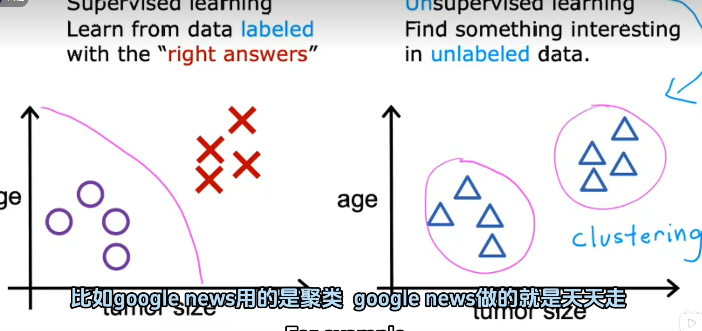

# 非监督学习

 - 按照监督学习的样例还是肿瘤那个， 非监督学习就是不用于判断肿瘤是否是良性还是恶性的标签， 而注重于找到一些结构或者模式，或者只是在数据中找到一些有趣的东西
 - 我们称它为无监督算法是因为， 我们不试图监督算法， 而是寻找一些模式或者结构， 寻找一些特征。
 - 无监督算法可能会决定将数据进行分类， 所以它可能会决定这里有一个集群， 这里有另一个集群
 ### 这是一种特殊的非监督学习， 名为聚类算法
- 下面是聚类算法与分类算法 `(监督学习)` 的对比图

 ## 聚类算法
 - googlnews用的就是聚类算法， 它每天在互联网上看十万篇新闻文章， 并将相关的故事组合在一 起， 很有意思的是他们可以通过查询某一个词， 将两个新闻关联在一起。我们没有告诉学习算法新闻具有某些特征， 但是它能从新闻中构建某些集群
  
  ### 总结一下无监督学习算法， 获取没有标签的数据并尝试自动将他们分组到集群中

  ## 在第二节课中让我们给无监督学习一个更正式的定义
  - 在监督学习中， 数据同时带有输入x和输出标签y而在无监督学习中， 数据仅带有输入的x而没有输出标签y并且算法必须在数据中找到一些模式或者结果或者其他一些有趣的东西
  
我们看到的只是一种成为聚类算法的无监督学习示例， 它将相似的数据点组合在一起

### 我们还要学习以下一些算法

1. 异常检测算法
2. 降维
- 这使您可以将一个大数据神奇的压缩成一个小得多的数据集， 同时丢失尽可能少的信息
  