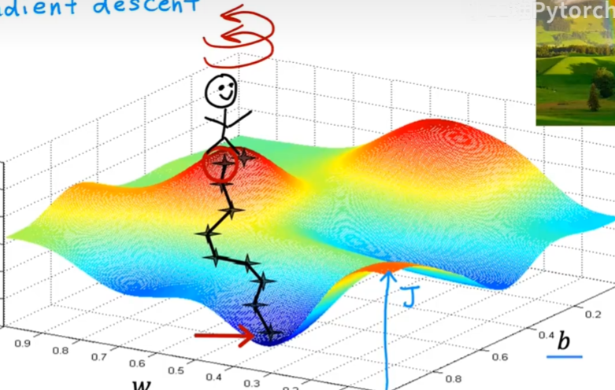

# 梯度下降

- 我们想要有一种系统的方法寻找 $J$ 的最小值， 梯度下降方法就是我们实现这一功能的算法

- Have some function $J(w, b)$
- want minimize $J(w, b)$
- Outline : Start with some $w, b$
Ganerally, we set $w = 0, b = 0$ 
keep changing $w,b$ to reduce $J(w, b)$. Until we settle at or near a minimum

- 可能有很多最小值， 绝对不止是一个， 如图所示
  

- 现在让我们想象一下， 这个曲面图实际上是一个稍微起伏的地面
- 我们站在山顶， 四处环顾去寻找一个下山的最佳方向， 确定一个方向然后开始迈出一小步,理论上你的一小步应该比任何一步都要下降的多，然后达到一个新的点继续重复这个过程，直到达到最低点 如图所示：

- 如果我们没有到达最低的那个点而是到达了另外的低点，我们称去的路为局部最小值路($localminimum$)

# 如何实现梯度下降算法

### $$w = w - \alpha \frac{\partial J(w, b)}{\partial w}$$

- (复习一下$J(w, b) = \frac{1}{2m} \sum_{i=1}^{m}(f_{w,b}(x^{(i)}) - y^{(i)})^2 ||f(x)_w, _b = wx + b $)

- 等号是给赋值运算符不是数学意义上的等于
- $\alpha$ 是学习率($leaning -rate$)，大小位于0，1之间，基本作用是控制下坡时步子的大小，如果说$\alpha$很大，说明在下降过程中你采取了巨大的变化
- $\frac{\partial J(w, b)}{\partial w}$ 是梯度($Derivative$)

我们不止有一个参数 $w$ 我们还有另一个参数 $b$ 可以类推出公式

### $$b = b - \alpha \frac{\partial J(w, b)}{\partial b}$$

通过上面的两个方程式我们于是开始不断的尝试，这两个方程要保证同时更新这样我们才能正确达到我们需要的目的， 实现我们的目标，下面展示一下正确的做法

### Correct simultaneous update

$$tmp_w = w - \alpha \frac{\partial J(w,b)}{\partial w}$$ $$tmp_b = b - \alpha \frac{\partial J(w,b)}{\partial b}$$$$w = tmp_w$$$$b = tmp_b$$

- 然后一直循环下去，知道达到最低点
- 一般说的梯度下降公式指的是同步更新的梯度下降

# 梯度下降直觉

- 我们将学习这个学习率是干什么的， 同时也要学习一下这个偏导数是干什么的同时他们为什么要相乘

- 先假设我们只有一个参数 $w$
  - $w = w - \alpha \frac{\partial J(w)}{\partial w}$
  - 然后这个过程如图所示

# 学习率

- 如果学习率太小，那么你采取的是一个非常小的一步， 这将花费特别多的时间
- 如果学习率太大， 那么梯度下降可能会超过最小值， 可能导致梯度下降没办法达到最小值， 甚至可能发散

### 一般来说，一个固定的学习率是可以到达局部最小值的( $local-minimum$ )

# 线性回归的梯度下降

$$ \frac{\partial J(w,b)}{\partial w} = \frac{1}{m} \sum_{i=1}^{m} (f_w,_b(x^{(i)}) - y^{(i)})x^{(i)} $$
$$ \frac{\partial J(w,b)}{\partial b} = \frac{1}{m} \sum_{i=1}^{m} (f_w,_b(x^{(i)}) - y^{(i)}) $$

- 这两个方程式是通过微积分求出来的

- 如果你初始化不一样的 $w,b$, 那么他们达到的局部最小值可能会不一样

# 运行梯度下降算法

- 整个梯度下降算法是这样实现的

