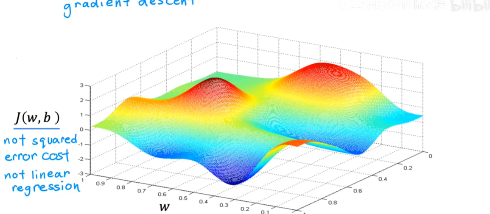

# 梯度下降

- 我们想要有一种系统的方法寻找 $J$ 的最小值， 梯度下降方法就是我们实现这一功能的算法

- Have some function $J(w, b)$
- want minimize $J(w, b)$
- Outline : Start with some $w, b$
Ganerally, we set $w = 0, b = 0$ 
keep changing $w,b$ to reduce $J(w, b)$. Until we settle at or near a minimum

- 可能有很多最小值， 绝对不止是一个， 如图所示
  

- 现在让我们想象一下， 这个曲面图实际上是一个稍微起伏的