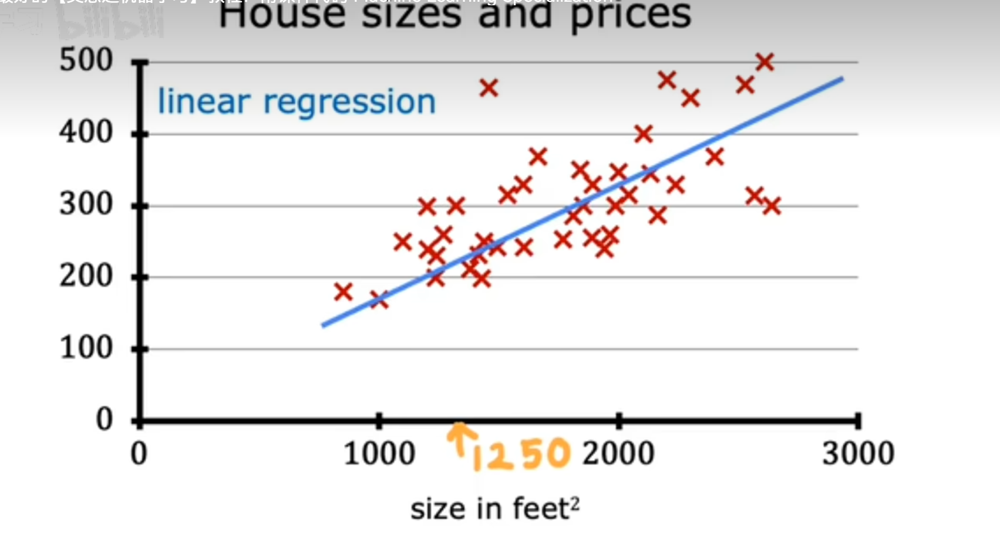
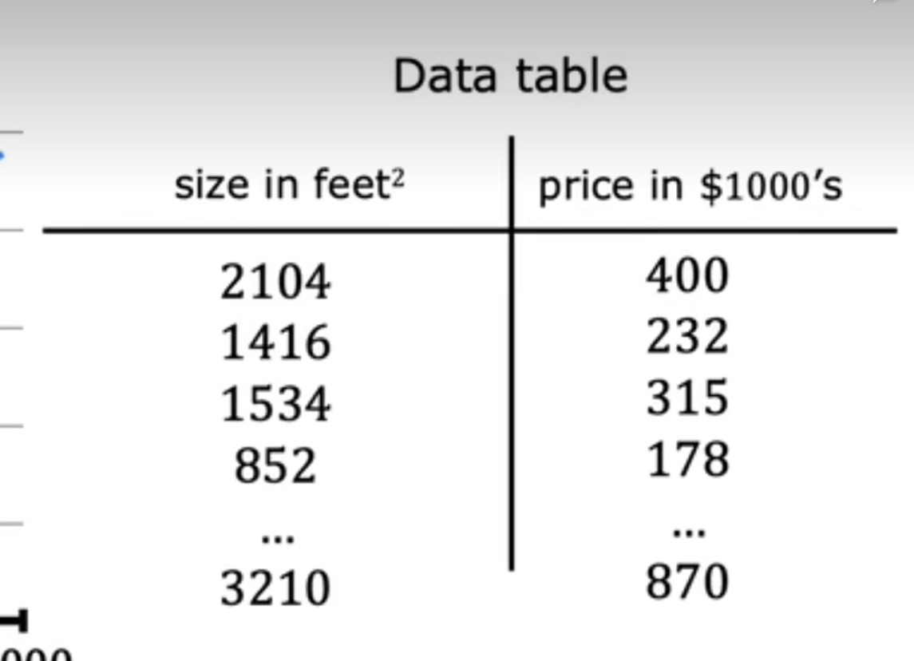
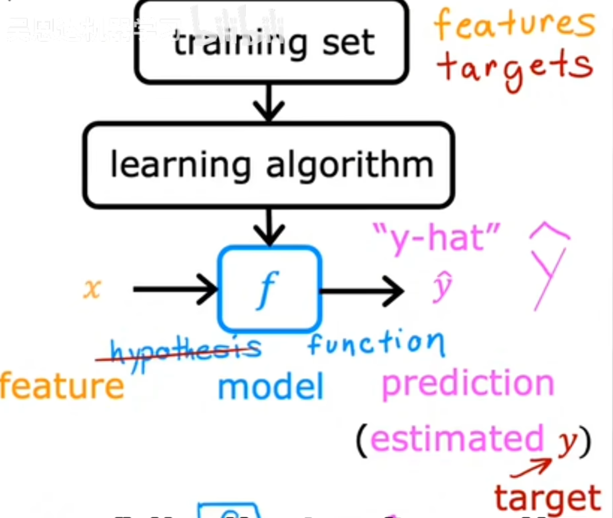
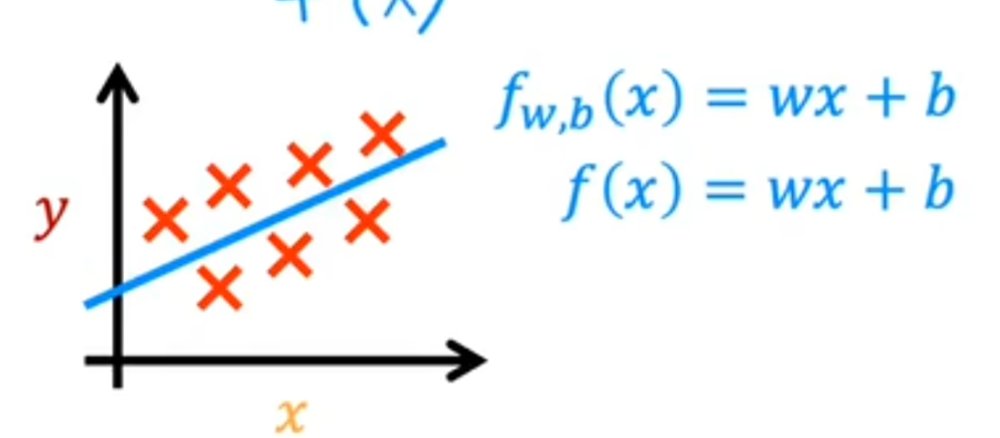

# 线性回归模型

- 这是本系列课程的一个模型， 这只是意味着为您的数据拟合一条直线

### 让我们用以前的一个例子进行举例， 是一个关于房价和房子的大小之间的关系的例子

- 线性回归模型就是将数据拟合成一条直线， 它可能看起来像这样

- 这样就可以预测在1250平方英尺的房子会卖多少钱， 也就是大约 $220,000$ 美元
  
`线性回归模型是一种特殊的监督学习， 它被称为回归模型， 因为它预测数字作为输出， 如美元价格`

### 任何预测诸如220000这类的数字的模型都是回归模型

- 分类模型预测类别或者离散类别， 例如预测图片是猫还是狗， 如果给定病例， 它必须预测患者是否患有特定疾病

### 线性回归除了画上面的图标， 还有另一种查看有用数据的方法， 即数据表

### 机器学习术语！：
- 刚刚的训练模型的数据集称为训练集， 训练集是用来训练模型的， 也就是让模型学习数据的特征

- 要预测客户的房价， 您首先要训练模型以及从训练集中学习， 然后该模型可以预测客户的房价

- 在机器学习中表示输入的标准符号是小写的 $x$ ，我们称之为 `输入变量` ($input variable$ || $feature variable$)，而输出的标准符号是大写的 $y$ ，我们称之为 `输出变量` ($output variable$ || $target variable$)。
  - 例如， 对于训练集的第一个房子， $x$ 是房子的大小， 所以 $x = 2104$， $y$ 是房子的价格， 所以 $y = 400$
  
  - 训练集的第一个房子是 $x = 2104$ 和 $y = 400$， 这就是我们在上面看到的表格
  
- $m$ 是训练集的样本数， $m = 47$ (number of training examples)， 也就是训练集的行数， $n$ 是特征的数量， $n = 1$， 也就是训练集的列数， $x$ 是训练集的特征， $y$ 是训练集的标签

- $(x, y)=(2104, 400)$, 代表一个单独的训练样本， 我们一般要精确到训练集的每一行， 所以一般要添加上标 $i$ ($i^{(th)}$ training example)， 例如 $x^{(1)}$ 和 $y^{(1)}$， 代表第一个训练样本， $x^{(2)}$ 和 $y^{(2)}$ 代表第二个训练样本， 以此类推
- $x^{(3)}$ 和 $y^{(3)}$ 代表第三个训练样本， 以此类推

- 在机器学习中， 我们常常将过程表达成这个形式

- 我们将训练集交给学习算法， 然后学习算法得出了一个模型 $f$ ( $model$ )， 然后这个模型可以用于预测, 得到一个预测值 $\hat y$ ($y-hat$) $\hat y$ 是 $y$ 预测值
  
### 那我们该如何表达 $f$ 呢？

$$
f(x)_w, _b = wx + b
$$
- 这里的 $w$ 和 $b$ 是模型的参数， $w$ 是权重， $b$ 是偏置， 这两个参数是我们要学习的， 我们要通过训练集来学习这两个参数， 使得模型的预测值 $\hat y$ 尽可能接近真实值 $y$

- 更具体的数， 这个模型是单变量线性回归， 它只考虑一个特征变量作为输入， 输出是一个标量， 也就是预测值是一个标量， 而不是向量或者矩阵。