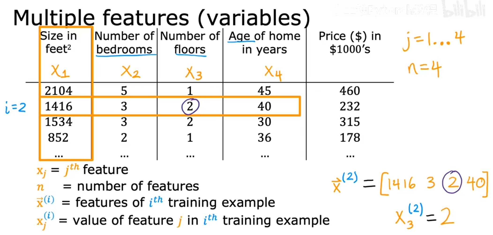

# 多特征(Multiple Feature) 

$x^{(i)}_j$ 是第 $i$ 个训练样本的第 $j$ 个特征, $x^{(2)}_3$ 是第 $2$ 个训练样本的第 $3$ 个特征， 这里就是 $2$ 
一个训练样本一般用行向量来表示， $\vec{x}^{(i)} = [1416\;3\;2\;40]$ 

- 如果我们有n个特征， 那么我们的模型就会变成这样

### $$f_w, _b(x)=w_1x_1+w_2x_2+...+w_nx_n+b$$

- 我们可以用两个向量来简化这个公式， 一个向量来表示特征， 一个向量来表示权重
  
$$\vec{w} = [w_1,w_2,...,w_n]$$ $$\vec{x} = [x_1,x_2,...,x_n]$$
### $$f_{\vec{w}, b}(x) = \vec{w} \cdot \vec{x} + b$$

# 我们把这个模型叫做多元线性回归
