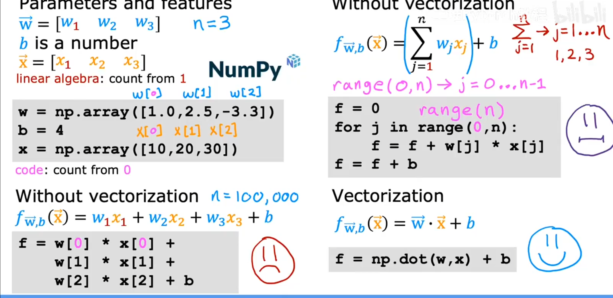
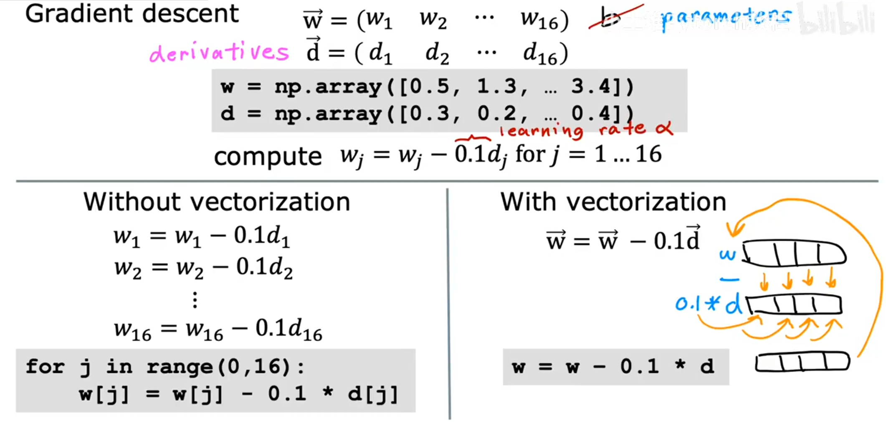

# 向量化

- 向量化可以使得代码变得更加简洁， 同时可读性更高

```python
import numpy as np
w = np.array([1.0, 2.5, -3.3])
b = 4
x = np.array([10, 20, 30])
f = np.dot(w, x) + b
print(f)
```

- 而且使用 $numpy$ 也可以使代码更加高效， 因为 $numpy$ 可以利用计算机的并行处理能力， 使代码运行速度更快， 比顺序和循环计算的要快



### 如果我们用用 $numpy$ 进行计梯度下降公式， 那么代码会更加简洁， 而且效率更高

