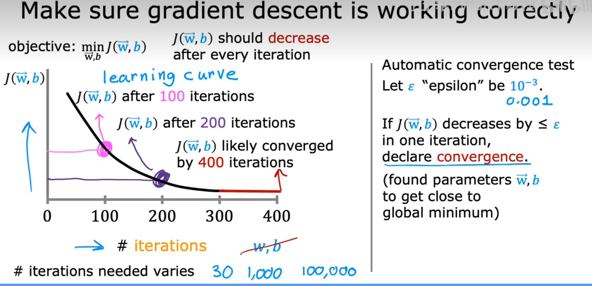

# 检查梯度下降是否收敛

在使用梯度下降法训练模型时，我们通常需要判断算法是否已经收敛。常见的检查方法有：

1. **观察损失函数（Cost Function）变化**  
   每次迭代后记录损失函数 $J(w, b)$ 的值，并绘制成曲线。如果损失函数随着迭代次数不断减小，并最终趋于平稳（变化很小），说明梯度下降已经收敛。

2. **设置阈值**  
   如果损失函数的变化量 $|J_{k+1} - J_k|$ 小于某个很小的阈值（如 $10^{-4}$），可以认为已经收敛。

3. **观察参数变化**  
   如果每次迭代参数 $w$ 和 $b$ 的更新幅度非常小，也可以认为已经收敛。

---

**可视化方法：**  
通常会画出损失函数随迭代次数的变化曲线（如下图），如果曲线趋于平稳，就说明收敛。

---

**总结：**  
- 损失函数趋于平稳或变化很小时，说明梯度下降收敛。
- 可以结合损失函数变化和参数变化共同判断。